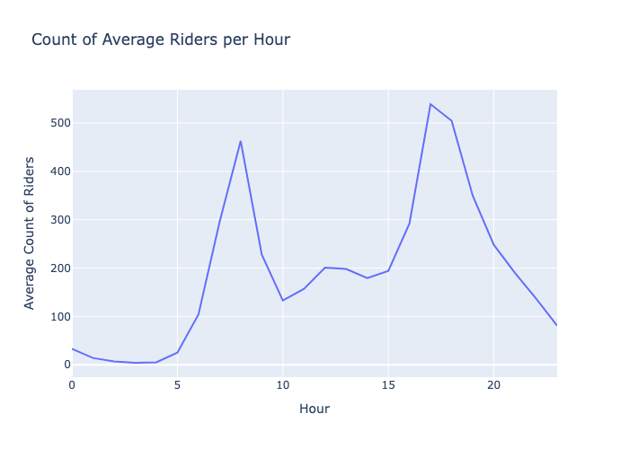
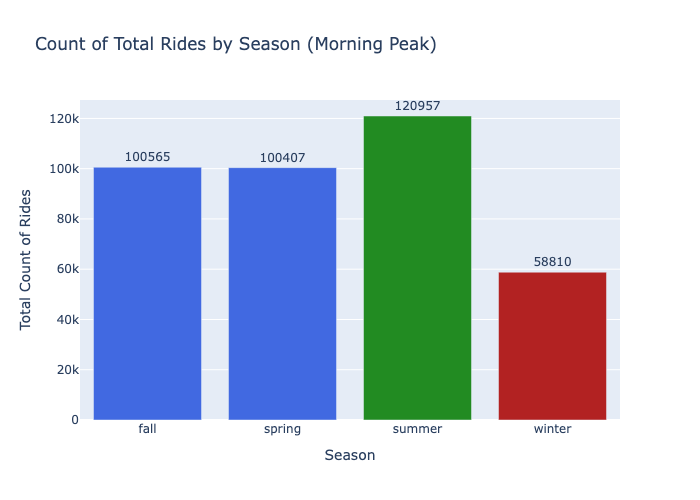
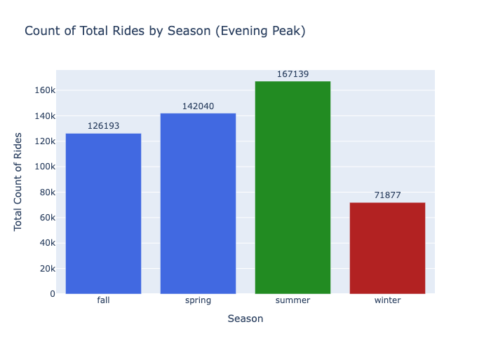
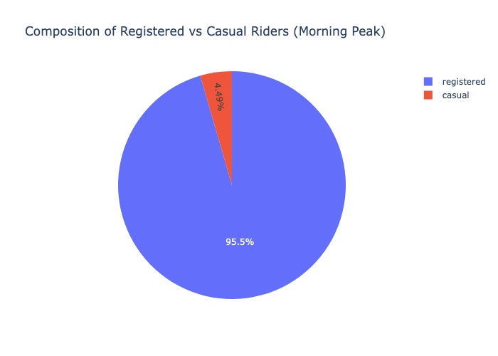
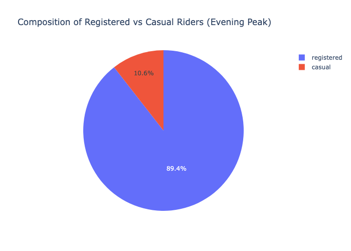
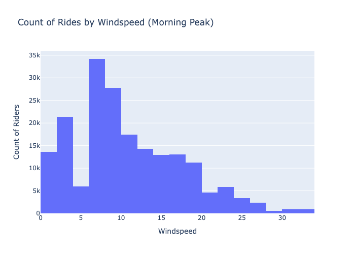

<a name="bike-share-analysis"></a>
# :bike: Bike Share Analysis
### by [Vincent Perez](https://www.linkedin.com/in/thevinceperez/)

## Table of Contents

- [Business Problem & Stakeholders](#business-problem)
- [Exploratory Data Analysis](#exploratory-data-analysis)
- [Insights and Recommendations](#insights-and-recommendations)
- [Final Recommendations](#final-recommendations)
- [Ethics and Biases](#ethics-and-biases)
- [Repo Navigation](#repo-navigation)


<a name="business-problem"></a>
# :thinking: <ins> Business Problem </ins>

### The characteristics of bike share data make it valuable for research. Unlike buses or subways, bike sharing systems record the duration of each trip, as well as the departure and arrival locations. This ability turns them into a network that can be used to sense and study mobility in cities.
### I work as a data analyst on the BikeShare Product Team. Our stakeholders have asked us to extract insights from hourly usage data. They’re looking for a general overview of the business and recommendations on how to best support the company.

## The stakeholders are:

### <ins>Primary Stakeholders' interests:</ins>
***The Park General Manager*** would like to know:
- When demand is strong or fragile.
- User behavior patterns.
- Which hypotheses to prioritize next quarter.

### <ins>Supporting Stakeholders' interests:</ins>
**Operations Lead:**
- Low-impact maintenance windows.

**Marketing Lead's priorities:**
- Best timing for promos.
- Breakdown of Casual vs Registered riders.

**Policy & Ethics Advisor:**
- Avoiding decisions that disadvantage specific times/areas.

</br>

## So we start the analysis asking the question: 
# How can we best ensure the safety, efficiency, and profitability of our bikes?

# :broom: <ins>Data Cleaning and Processing</ins>

- Used the `.info()` method to ensure all columns had no **missing values**,
- Changed the **data type** of the `"dteday"` column to datetime
- **Feature engineered** new column `"not_norm_windspeeds"` by denormalizing `"windspeed"` column, making windspeed more legible for future safety recommendations.


## Filtering the Data

I chose to subset the data using the `"workingday"` column where `"workingday"` is equal to 1. </br>


This means the subset represents weekdays (Monday through Friday) excluding holidays. I chose this sample because it's where the bulk of the data lies, focuses on periods of stronger demand and highlights potentially profitable hours. </br>

To support this decision further, I performed a Welch's T-Test to determine if there was a statistically significant difference between the means when `"workingday"` is true versus false. </br>

```
# Do average hourly rides differ between working days and non-working days?

# H 0 : Average hourly working day rides do not differ from average hourly non-working day rides.
# H 1 : Average hourly working day rides differ from average hourly non-working day rides.

  alpha = 0.05
  workingday = df[df['workingday'] == 1]
  notworkingday = df[df['workingday'] == 0]

# pingouin ttest
  ping = pg.ttest(x=workingday['cnt'],y=notworkingday['cnt'],confidence=1-alpha)

# BOTH TESTS SAY THERE IS A SIGNIFICANT DIFFERENCE 
# BETWEEN THE RIDER AVERAGES OF WORKING DAYS AND NOT WORKING DAYS
```

Our **p-value** was calculated at 0.000042, concluding a *statistical significance* between the means of average hourly working-day rides to not working-day rides. </br>

I was able to reject the Null Hypothesis with a power of 98% justifying the difference in means is not only substantial, but a **real finding**.

## Exploratory Data Analysis

To visualize the mean of working-days, I plotted the data on a line graph and found trends in the hourly usage of bikes:</br>



I noticed that the data presented a bimodal distribution. This means there are two distinct peaks, indicating our bike rides occur more frequently during specific time periods.</br>

I did more **feature engineering** to pinpoint the time periods. </br>

The feature consisted of grouping hours and creating a "timebin" column. Using this column, I was able to categorize the means of the hours in a day. </br>
These categories included
- Peak Hours: all hours with a mean on or above the 80th quantile (275)
- Not Peak: hours with a mean less than 275 and above 100
- Maintenance: any mean below 100


I found the top two hours fell within the morning (7 and 8) and evening (17 and 18) peaks. </br>

Our line graph also answers the **Operations Lead's** question, as it highlights the best maintenance hours. These fell between the hours 23:00 and 5:00, and they have a grouped average count of bike riders less than 81 rides an hour. </br>

I decided to further analyze our morning and peak hours to answer more stakeholder questions and provide recommendations.

<a name="insights-and-recommendations"></a>
# :bulb: <ins>Insights and Recommendations<ins/>

## Seasonality

To guide marketing decisions, I decided to analyze seasonal trends between morning and evening hours by comparing the total number of bike riders each season. </br>

### Morning Peak Seasonal Totals:



### Evening Seasonal Totals:



Insights:
- The seasonal bar chart for peak data supports our overall data line graph, showing evenings have more bike counts than mornings.
- Summer is by far the most popular time for bike riding, making it the best season for promotional offers.
- Morning and evening differ in their second-best seasons: for mornings, it's fall; for evenings, it's spring.
- Winter has the least sum of bike riders.

Recommendations:
- Create marketing opportunities during the summer season, as more ridership occurs.
- When creating secondary marketing opportunities, focus on time of day as both times of day present different opportunities for best marketing strategies.

## User Composition

Using the data's "registered" and "casual" columns, we can find the composition of bike riders during peak hours. This will allow us to understand the user base for more promotional offers.

### Morning Peak Composition: </br>



### Evening Peak Composition: </br>



Insights:
- Most of our customers during both time periods are registered
- Evening has a larger percentile of casual users

Recommendations:
- Although the number of registered users is large, there is still an opportunity to leverage our understanding of casual users, as we know evening hours are composed of more casual users.

## Safety Concern
Knowing that ride frequency is highest during peak hours, I examined wind speeds during those times and compared them to ride counts to see if there are any potential safety-related concerns.

### Morning Histogram: </br>



### Evening Histogram: </br>


Insights:
- Most bike riders occur when windspeeds are between 0-20.
- Wind speeds can exceed 30 in both the morning and evening, potentially indicating dangerous conditions such as debris, reduced control, or discomfort.

Recommendations:
- Develop a feature that alerts users when wind speeds exceed 30, helping prevent rides in unsafe conditions.

<a name="final-recommendations"></a>
# :ballot_box_with_check: <ins> Final Recommendations </ins>
Tailoring the findings of our analysis to each stakeholder,
1. **Park General Manager:**
 - Demand is strongest during our evening peak hours of 17:00 and 18:00, as we receive more bike riders.
 - Winter is a good time for hypothesis testing, the impact is lower, but still has enough rider data to observe real effects.
2. **Operations Lead:**
 - Best times for maintenance are between the hours of 23:00 and 5:00 as our user count is low compared to other hours. 
 - The mean rider count is less than 10 during hours of 2:00 and 4:00, ideal for preparing for peak hours.
3. **Marketing Lead:**
 - Summertime is the best time for promotional offers, as our rider count is consistently larger throughout the day. Promotions like discounted rides can make our rider count skyrocket as there is already a lot of interest.
 - Bike riders are more frequently registered users compared to casual, but trials for registered-user features during evening rides can influence our registered user count for the evening composition.
4. **Policy and Ethics Advisor:**
 - Create safety protocols and features to alert users of winds above 30, as peak hours are dangerous in cities.

<a name="ethics-and-biases"></a>
## <ins>Ethics and Biases </ins>
### Data Biases
 - Some dates resulted in less than 24 hours due to weather conditions.
 - Unable to identify location-based influences as our data did not include location information.
 - Pricing of service or registration was not included in the data.

### REPO NAVIGATION
```
|--data/
|-----hour.csv
|--figures/
|------eveninghist.png
|------eveningpie.png
|------eveningseasonality.png
|------linegraph.png
|------morninghist.png
|------morningpie.png
|------morningseasonality.png
|--notebooks/
|------EDA.ipynb
|------statisticaltest.ipynb
|--.gitignore
|--README.md
```
|[back to top](#bike-share-analysis)
