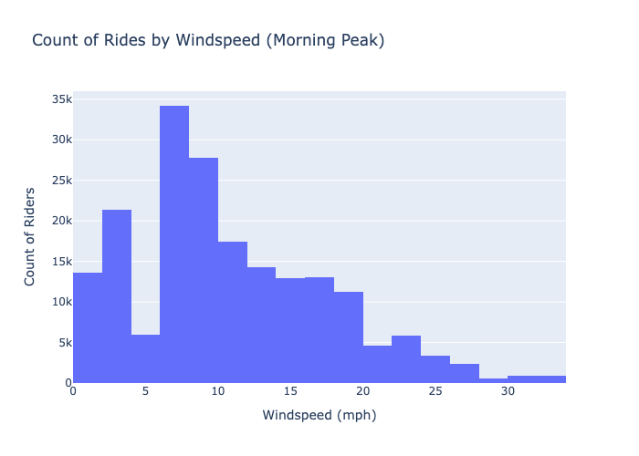
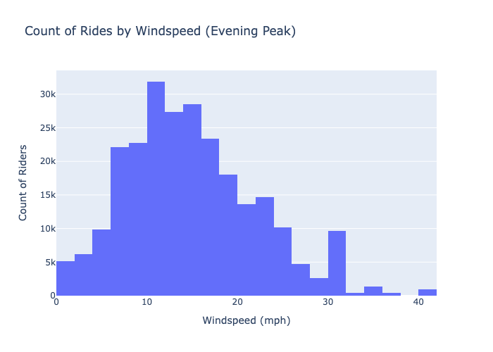

# Bike Share Analysis
### by [Vincent Perez](https://www.linkedin.com/in/thevinceperez/)

## Table of Contents

- [Business Problem & Stakeholders](#business-problem)
- [Exploratory Data Analysis](#exploratory-data-analysis)
- [Insights and Recommendations](#insights-and-recommendations)
- [Final Recommendations](#final-recommendations-for-next-quarter)
- [Ethics and Biases](#ethics-and-biases)
- [Repo Navigation](#repo-navigation)

# Business Problem:

### The characteristics of bike share data make it interesting for research. Unlike buses or subways, bike sharing systems record the duration of each trip, as well as the departure and arrival locations. This ability turns them into a network that can be used to sense and study mobility in cities.
### I’m a data analyst on the BikeShare Product Team. Our stakeholders have asked me to extract insights from the hourly usage data. They’re looking for a general overview of the business and recommendations on how to best support the company.

## The stakeholders are:

### <ins>Primary Stakeholder's interests:</ins>
***Park General Manager*** would like to know:
- When demand is strong or fragile.
- User behavior patterns.
- Which hypotheses to prioritize next quarter.

### <ins>Supporting Stakeholders' interests:</ins> 
**Operations Lead:**
- Low-impact maintenance windows.

**Marketing Lead:**
- Best timing for promos.
- Segments of casual rider vs registered.

**Policy & Ethics Advisor:**
- Avoiding decisions that disadvantage specific times/areas.

 

## So we ask the question: 
# How can we best ensure the safety, efficiency, and profitability for our bikes?

### <ins>Data Cleaning and Processing<ins>  

- Used the .info() method to ensure all columns had no **Missing Values**,
- Changed the **Data Type** for dteday column to datetime
- **Feature Engineered** new column "not_norm_windspeeds" by denormalizing "windspeed" column, making windspeeds more legible for future safety recommendaitons.

I chose to subset the data to work with "workingday" column where "workingday" is 1.  

This means the subset represents Monday through Friday without holidays. I chose this sample because it's where bulk of our data lays within, focusing on stronger demand, and highlights potential profitable hours.

### <ins>Exploratory Data Analysis<ins>

I plotted our data on a line graph to find strends in the hourly usage of bikes: 

After plotting, I noticed our data presented a bimodal distribution. This mean there are two distinct peaks, indicating our bike rides occur more frequently. 

I did more **feature engineering** to pinpoint these hours.  

Grouping all hours and creating a "timebin" column, I was able to categorize the means of all hours.  
These categories included
- Peak Hours: all mean hours on or above the 80th quantile (275)
- Not Peak: mean hours less than 275 and above 100
- Maintenance: anything below 100

and found the top two hours for morning and evening were:

The morning hours of 7 and 8,  
The evening hours of 17 and 18.  

Our line graph also answers our **Operations Lead** question as best maintenance hours are between hours 23-5, as they have a grouped average count of bike riders less than 81 an hour.  

I decide to further analyze our morning and peak hours to answer more stakeholder questions and provide recommendations.

# Insights and Recommendations

## Seasonality

To direct any type of marketing, I decided to look for any seasonal trends between morning and evening hours by comparing each season's totals of bike riders.  

### Morning Peak Seasonal Totals:

### Evening Seasonal Totals:

Insights:
- The seasonal bar chart for peak data supports our general data line graph with evenings having more bike counts than morning
- Summer is by far the most popular time for bike riding, making it the best season for any promotional offers
- Morning and Evening differ with second best season, as morning's second best season is fall and evening's is spring.

Recommendations:
- Create marketing opportunities during the summer season, as more riders occur during this season.
- When creating secondary marketing opportunities, focus on time of day as both times of day present different opportunities for best marketing strategies.

## User Composition

Using the data's "registered" and "casual" columns, we can find the composition of bike riders during peak hours. This will allow us to understand the user base, for more promotional offers.

### Morning Peak Composition:  

### Evening Peak Composition:  

Insights:
- most of our customers during both time periods are registered
- evening has a larger percentile of casual users

Recommendations:
- Although our registered amount is large, still shows opportunity to leverage our understanding of casual users, as we know evening hours compose of more.

## Safety Concern
Knowing the frequency of rides occuring during peak hours, I looked further into windspeed during these peak hours to and compared to count of rides see if theres a potential feature that supports safety.

### Morning Histogram:  

### Evening Histogram:  

Insights:
- Most bike riders ride around 0-20 windspeeds.
- Windspeeds can trend to above 30 for both morning and evening (could be dangerous weather conditions of not alarmed)

Recommendations:
- Create software that warns users of windspeeds when windspeeds go about 30 to prevent bike accidents due to debris or uncomfortable conditions.
